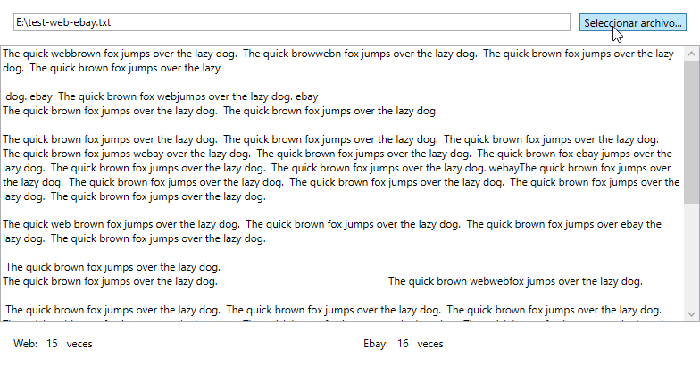

# Autómata Web 

Autómata que lee un archivo y cuenta la cantidad de veces que aparecen las palabras `"web"` y `"ebay"`.

## Instrucciones de uso

1. Presionar el botón de seleccionar archivo.
2. Seleccionar un archivo de texto (`*.txt`)
3. Una vez seleccionado, se mostrará inmediatamente el contenido del archivo, y en la parte inferior aparecerá la cantidad de veces que se repiten las palabras `"web"` y `"ebay"`.

